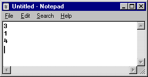

# Summing Three Numbers from a File

First, create a file in Notepad containing three integers separated
by some whitespace. Save it as `3nums.txt` in the same folder
as your code.



Then write a program that reads three integers from the file
`3nums.txt` and displays (on the screen) the total of the
integers.

Name your program `131_sum_from_file.py`

```
Reading numbers from file "3nums.txt"... done.

3 + 1 + 4 = 8

```

---


©2021 Daniel Gallo


This assignment is licensed under a
[Creative Commons Attribution-NonCommercial-ShareAlike 3.0 United States License](https://creativecommons.org/licenses/by-nc-sa/3.0/us/deed.en_US).  


Adapted for Python from Graham Mitchell's [Programming By Doing](https://programmingbydoing.com/)