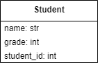

# Drain Capping

Take your drain method from the [previous exercise](drain-method.md) and prevent it from being drained below a volume of `0`.

### What is expected
```python
tub = Bathtub("white", 20)
tub.drain(15)
print(tub.current_volume)  # should be 5
tub.drain(15)
print(tub.current_volume)  # should be 0, NOT -10
```


[Interpreter Check](interpreter-check.md)

---

©2021 Daniel Gallo

<p xmlns:cc="http://creativecommons.org/ns#" >This work is licensed under <a href="http://creativecommons.org/licenses/by-nc-sa/4.0/?ref=chooser-v1" target="_blank" rel="license noopener noreferrer" style="display:inline-block;">Attribution-NonCommercial-ShareAlike 4.0 International</a></p>