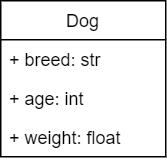

# Getting Data from a File


Make a class to store information about a dog. See the UML for what fields it will hold.

UML
---


Using Notepad or the text editor of your choice, create a text file containing six pieces of information (the breed, age, weight for two dogs). Save this file in your home directory.

Create two `Dog` objects (not in a list).

Ask the user for the name of a file to open, and open that file and read in the breed, age, weight, and breed, age, weight from the file.

Display the values you read in.

Name your program `getting_data_from_a_file.py`

```
Which file to open: dogs.txt
Reading data from dogs.txt

First dog: Yorkie, 4, 14
Second dog: Great Dane, 7, 93

```

---


©2021 Daniel Gallo


This assignment is licensed under a
[Creative Commons Attribution-NonCommercial-ShareAlike 3.0 United States License](https://creativecommons.org/licenses/by-nc-sa/3.0/us/deed.en_US).  


Adapted for Python from Graham Mitchell's [Programming By Doing](https://programmingbydoing.com/)