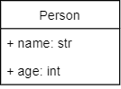

# Getting More Data from a File


Using Notepad or the text editor of your choice, create a text
file containing five names and five ages. Save this file in your home
directory.

Make a class to store information about a person:




Create a list of five `Person` objects.

Ask the user for the name of a file to open, and open that file and read in five names and ages from the file.


Display the contents of the list using a loop.

```
Which file to open: nameage.txt
Reading data from nameage.txt

Steve Jobs is 50
James Brown is 71
Britney Spears is 23
Michael Jackson is 46
Stanley Kubrick is 76
```


---


©2021 Daniel Gallo


This assignment is licensed under a
[Creative Commons Attribution-NonCommercial-ShareAlike 3.0 United States License](https://creativecommons.org/licenses/by-nc-sa/3.0/us/deed.en_US).  


Adapted for Python from Graham Mitchell's [Programming By Doing](https://programmingbydoing.com/)