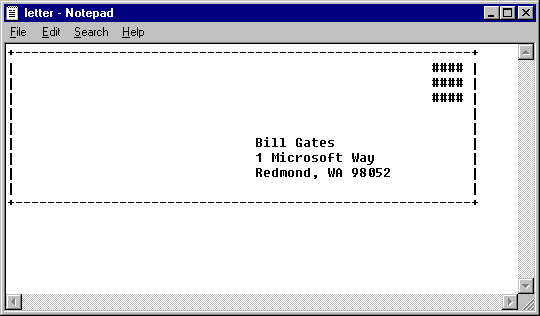

# Letter Revisited

Rewrite [A Letter to Your Principal](a-letter-to-your-principal.md),
but modify it so that instead of displaying the letter on the screen,
it puts it in a file.

When you run your program, it will appear to do nothing. But if you
wrote it correctly, it should have created a file in the same directory as your Python program called `letter.txt`  which you can then view using a text editor.

Name your Python program `letter_revisited.py`

What You Should See
-------------------
After running your program, we can find and open `letter.txt`. If you open it, it should look like:

---

©2021 Daniel Gallo

This assignment is licensed under a
[Creative Commons Attribution-NonCommercial-ShareAlike 3.0 United States License](https://creativecommons.org/licenses/by-nc-sa/3.0/us/deed.en_US).  

Adapted for Python from Graham Mitchell's [Programming By Doing](https://programmingbydoing.com/)