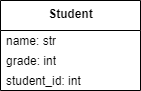

# On Initialization

Create an ``__init__`` method for the following classes. Create an object for each. Modify an attribute and print out the attribute.

---

©2021 Daniel Gallo

This work is licensed under <a href="http://creativecommons.org/licenses/by-nc-sa/4.0/?ref=chooser-v1" target="_blank" rel="license noopener noreferrer" style="display:inline-block;">Attribution-NonCommercial-ShareAlike 4.0 International</a>
