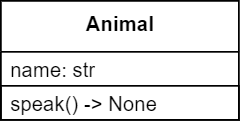

# Speak with Return Value

Continuing from the prior two exercises, we should move away from outputting from inside methods. This should normally only be done for debugging purposes. Rather than printing the information out, we should ensure our methods return a value.

Modify your code from [Speak with Name](speak-with-name.md) to return the speak string, rather than printing it out.



## Starter code
```python
class Animal:
    def __init__(self, name: str):
        self.name = name
    
    # place the instance method here (in the class)


dog = Animal("dog")
result = dog.speak()  
print(result)  # should output "The dog speaks"

cat = Animal("cat")
result = cat.speak()
print(result)  # should output "The cat speaks"
```
