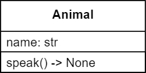

# Speak

Create the class with the following UML. We will be giving the ``Animal`` class an instance method called ``speak``. The purpose is to simply print out the string ``"GENERIC ANIMAL SOUND"``.



## Starter code
```python
class Animal:
    def __init__(self, name: str):
        self.name = name
    
    # place the instance method here (in the class)


a = Animal("dog")

a.speak()  # will raise an AttributeError
           # unless you implement it in the class
```

---

©2021 Daniel Gallo

<p xmlns:cc="http://creativecommons.org/ns#" >This work is licensed under <a href="http://creativecommons.org/licenses/by-nc-sa/4.0/?ref=chooser-v1" target="_blank" rel="license noopener noreferrer" style="display:inline-block;">Attribution-NonCommercial-ShareAlike 4.0 International</a></p>