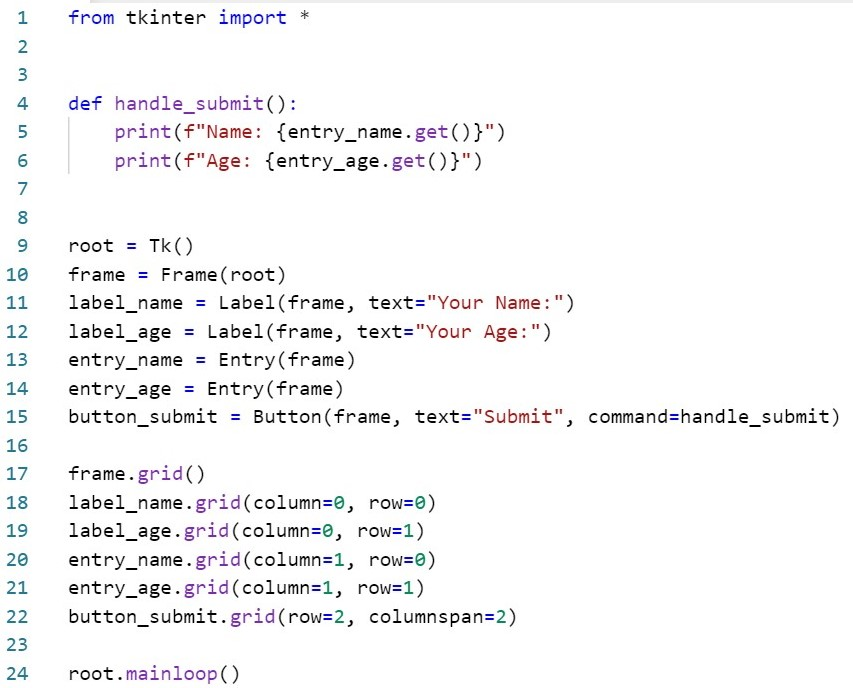
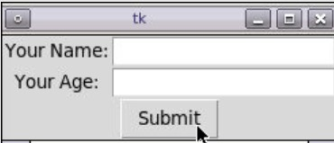

# Using Tkinter for Input
Type in the following code. Run it, and see what it does.

Name the file: `tkinter_intro.py`

As you can see, there is significant effort required to get a **Graphical User Interface** (GUI) set up. Most of the code here is creating and positioning the different widgets.

We will occasionally scratch the surface of building GUI applications, but it is good to keep to the basics as much as possible during the learning process.

What it should look like
------------------------

---

©2021 Daniel Gallo

This assignment is licensed under a
[Creative Commons Attribution-NonCommercial-ShareAlike 3.0 United States License](https://creativecommons.org/licenses/by-nc-sa/3.0/us/deed.en_US).  

Adapted for Python from Graham Mitchell's [Programming By Doing](https://programmingbydoing.com/)