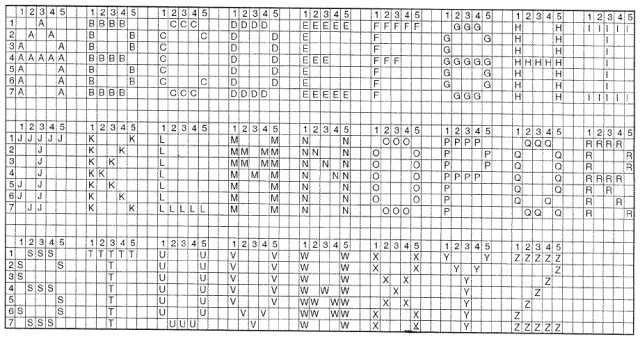

# Your Initials

Display your initials on the screen in block letters as shown.

```
For the name Jorge Balderama Perez...

JJJJJ  BBBB   PPPP
  J    B   B  P   P
  J    B   B  P   P
  J    BBBB   PPPP
J J    B   B  P 
J J    B   B  P 
 JJ    BBBB   P

```

In case you have no idea how to make a certain letter, there are some suggestions below.





---


©2021 Daniel Gallo


This assignment is licensed under a
[Creative Commons Attribution-NonCommercial-ShareAlike 3.0 United States License](https://creativecommons.org/licenses/by-nc-sa/3.0/us/deed.en_US).  


Adapted for Python from Graham Mitchell's [Programming By Doing](https://programmingbydoing.com/)